# Table of contents

* [About Manoa Flea Market](#about-manoa-flea-market)
* [Installation](#installation)
* [Application design](#application-design)
* [Development history](#development-history)
  * [Milestone 1](#milestone-1)
  * [Milestone 2](#milestone-2)
  * [Milestone 3](#milestone-3)

# About Manoa Flea Market

The Manoa Flea Market is a Meteor application that will offer UHM students a chance to sell or buy student-related goods and services. Similar to Craigslist, this application will: 

- Have students login with their UH credentials to access the system
- Connect buyers and sellers through UH credentials
- Items and services offered on this site will be geared specifically towards UHM students
- Users who violate the terms of use can be locked out of the system through their UH credentials

When you first come to our site, you will be on our landing page which will be similar to the following:

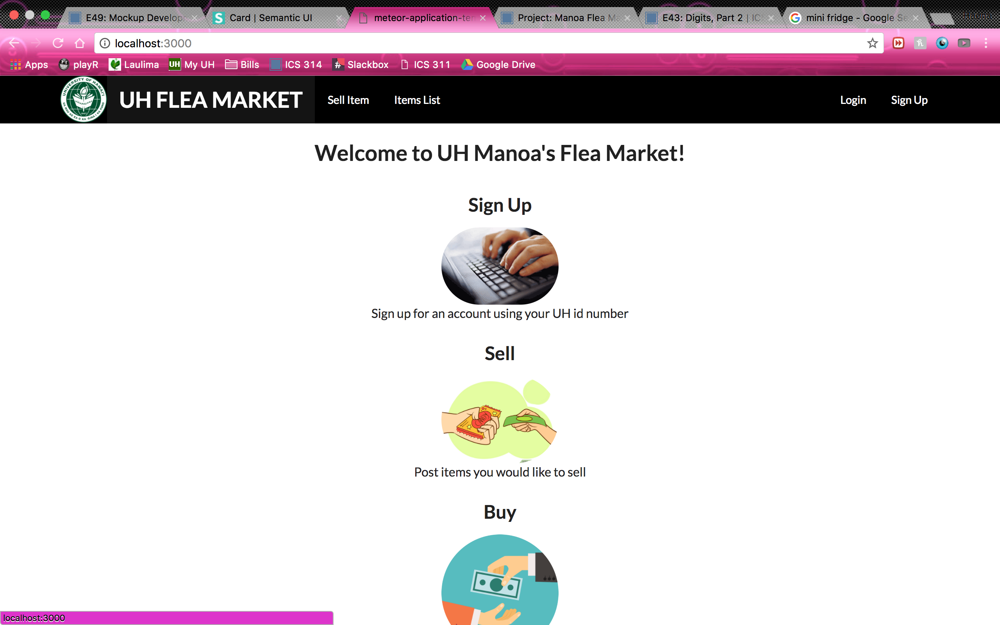

In order to use the system, you must be logged in. Once you click to log in, you will be directed into the log in page:

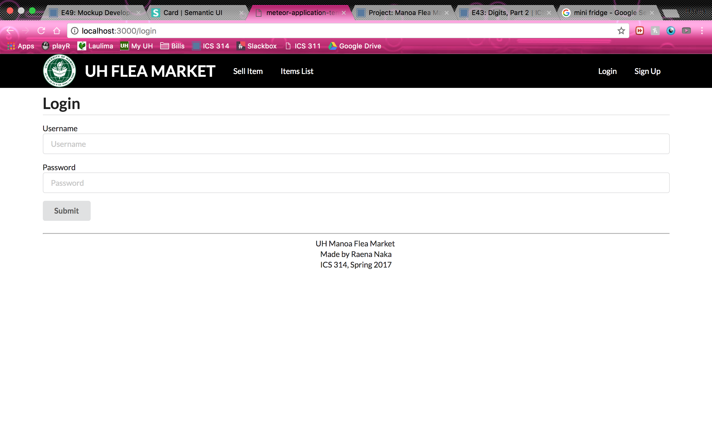

Once logged in, users will be directed to the User Home Page: 

However, users who have admin privileges will be direed to the Admin Home Page:

From either Home Page, you can list an item to sell, making sure you give a description and a photo:

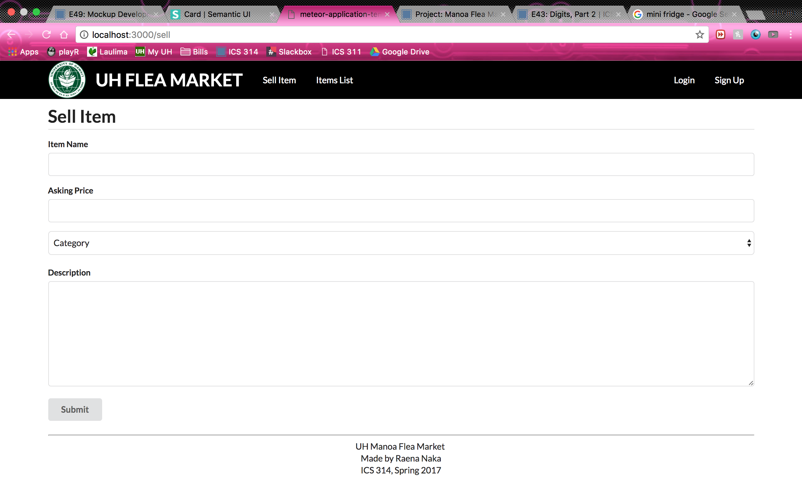

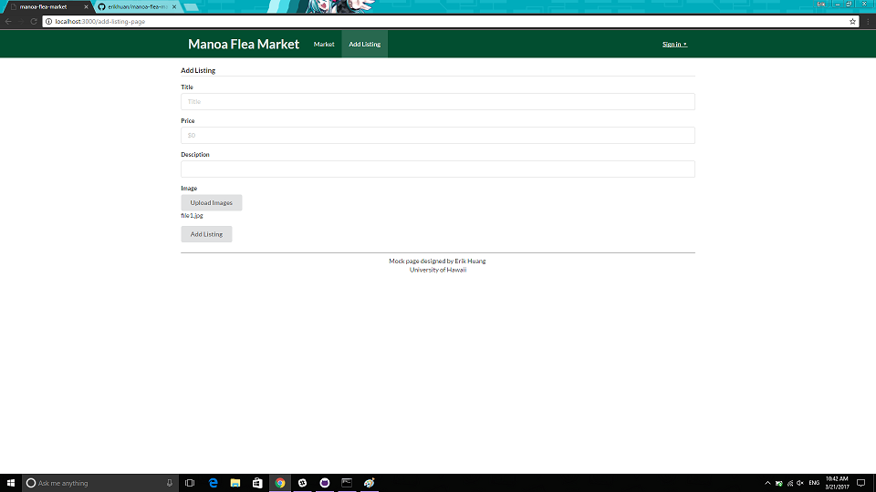

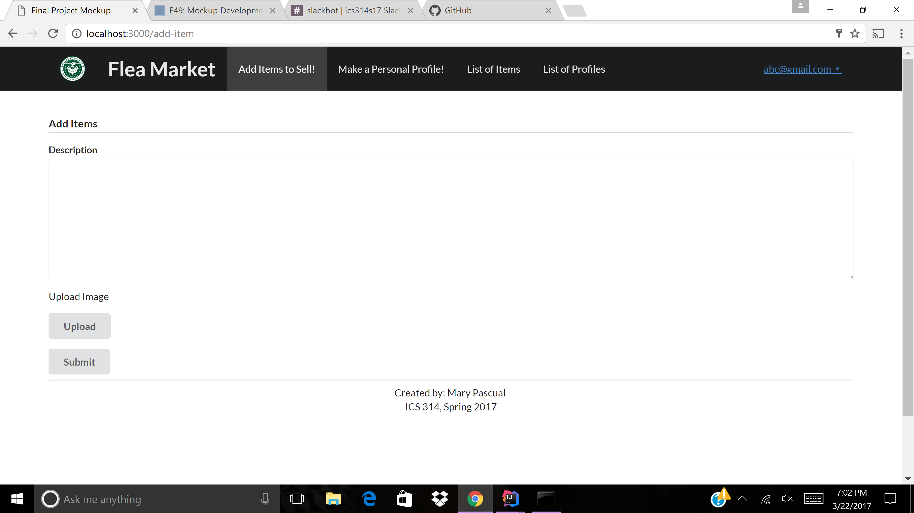

If need be, you may also choose to edit your listing: 

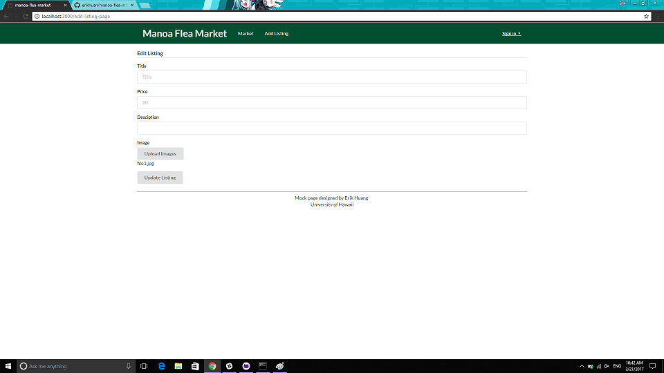

Once you have finished listing the item, the item will displayed on it's own separate page: 

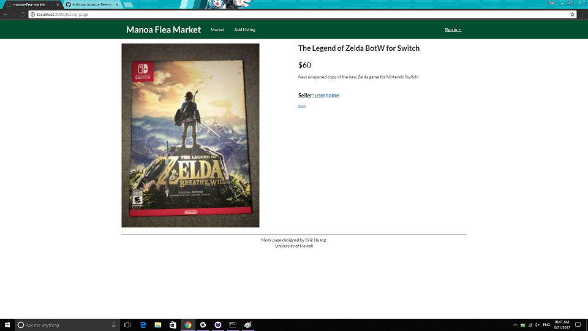

All the items for sale from the users will then be available on a communal sell page:

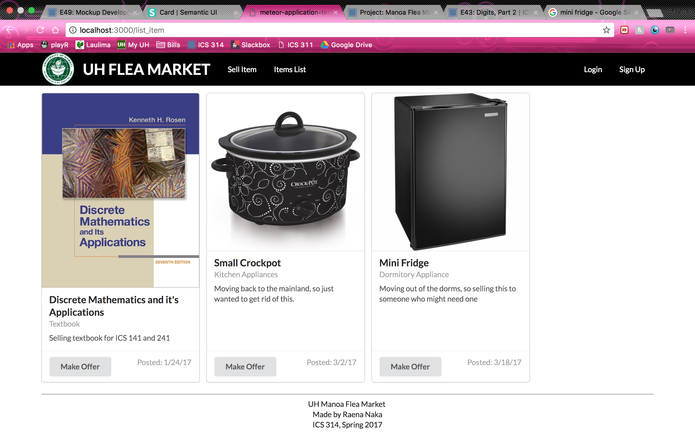

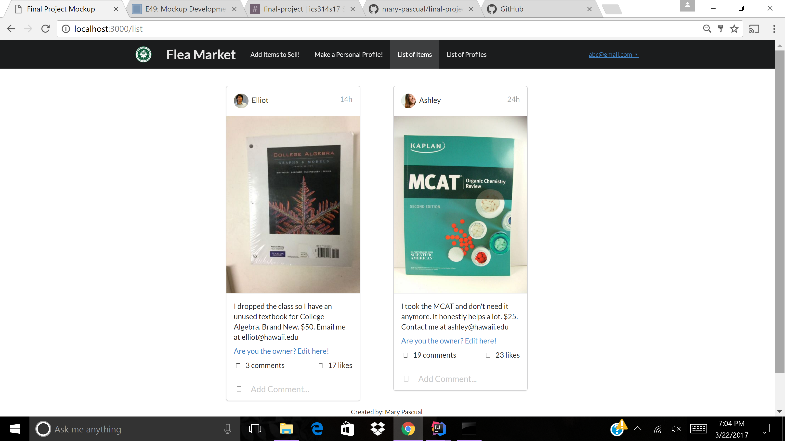

Users will also have profiles that can be viewed by other users:

These profiles can be created or edited through the use of these pages: 

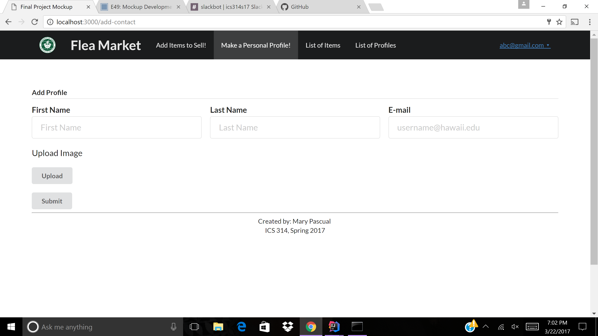

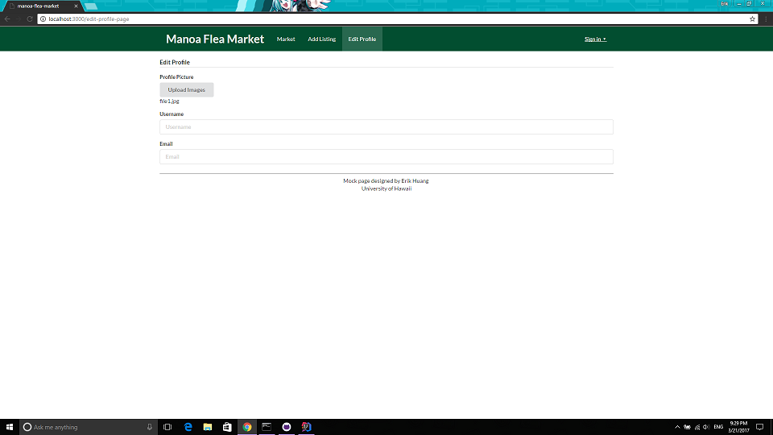

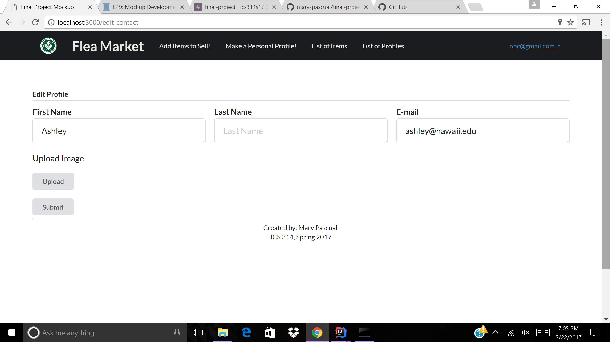

All the profiles will be accesible through a profiles list: 

# Installation

# Application Design

# Development History

## Milestone 1

## Milestone 2

## Milestone 3