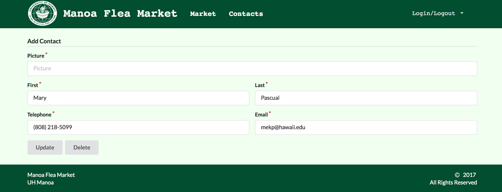

# Table of contents

* [About Manoa Flea Market](#about-manoa-flea-market)
* [Guided Tour](#user-guide)
* [Developer Guide](#developer-guide)
* [Application design](#application-design)
  * [Directory structure](#directory-structure)
  * [Import conventions](#import-conventions)
  * [Naming conventions](#naming-conventions)
  * [CSS](#css)
  * [Routing](#routing)
  * [Authentication](#authentication)
  * [Authorization](#authorization)
  * [Configuration](#configuration)
  * [Quality Assurance](#quality-assurance)
    * [ESLint](#eslint)
* [Development history](#development-history)
  * [Milestone 1](#milestone-1)
  * [Milestone 2](#milestone-2)
  * [Milestone 3](#milestone-3)
* [Initial User Study](#initial-user-study)
  * [Student Feedbacks](#student-feedback)

# About Manoa Flea Market

The Manoa Flea Market is a Meteor application that will offer UHM students a chance to sell or buy student-related goods and services. Similar to Craigslist, this application will: 

- Have students login with their UH credentials to access the system
- Connect buyers and sellers through UH credentials
- Items and services offered on this site will be geared specifically towards UHM students

# Guided Tour

A demo of the Manoa Flea Market can be viewed [here](https://manoa-flea-market.meteorapp.com)::

(Note: It's not yet complete)

When you first come to the site, you will be greeted by the following landing page:


In order to use the system, you must be logged in. Once you click to log in, you will be redirected to a login page where you must use your UH username and password:


Once logged in, users will be directed to the Home Page where they can navigate to different pages: 

 

Users will also be able to navigate through the top menu:


Users can list an item to sell, where the name and price is required while the picture, category, and description is optional:


If need be, you may also choose to edit your listing: 


All the items for sale from the users will then be available on a communal sell page:


Users can create a profile through the use of this page: 


All the profiles will be accessible through a profiles list: 


And can edit their profiles using this page: 



# Developer Guide

First, install [Meteor](https://www.meteor.com/install).

Second, download a copy of The Manoa Flea Market, or clone it using git.
(As of right now, the application is still under construction)
  
Third, cd into the app/ directory and install libraries with:

```
$ meteor npm install
```

Fourth, run the system with:

```
$ meteor npm run start
```

If all goes well, the application will appear at [http://localhost:3000](http://localhost:3000).

# Application Design

## Directory structure

The top-level directory structure contains:

```
app/        # holds the Meteor application sources
config/     # holds configuration files, such as settings.development.json
.gitignore  # don't commit IntelliJ project files, node_modules, and settings.production.json
```

## Import conventions

This system adheres to the Meteor 1.4 guideline of putting all application code in the imports/ directory, and using client/main.js and server/main.js to import the code appropriate for the client and server in an appropriate order.

This system accomplishes client and server-side importing in a different manner than most Meteor sample applications. In this system, every imports/ subdirectory containing any Javascript or HTML files has a top-level index.js file that is responsible for importing all files in its associated directory.   

Then, client/main.js and server/main.js are responsible for importing all the directories containing code they need. For example, here is the contents of client/main.js:

```
import '/imports/startup/client';
import '/imports/ui/layouts';
import '/imports/ui/pages';
import '/imports/ui/stylesheets/style.css';
import '/imports/ui/components/form-controls/';
```

Apart from the last line that imports style.css directly, the other lines all invoke the index.js file in the specified directory.

We use this approach to make it more simple to understand what code is loaded and in what order, and to simplify debugging when some code or templates do not appear to be loaded.  In our approach, there are only two places to look for top-level imports: the main.js files in client/ and server/, and the index.js files in import subdirectories. 

Note that this two-level import structure ensures that all code and templates are loaded, but does not ensure that the symbols needed in a given file are accessible.  So, for example, a symbol bound to a collection still needs to be imported into any file that references it. 
 
## Naming conventions

This system adopts the following naming conventions:

  * Files and directories are named in all lowercase, with words separated by hyphens. Example: accounts-config.js
  * "Global" Javascript variables (such as collections) are capitalized. Example: Profiles.
  * Templates representing pages are capitalized, with words separated by underscores. Example: Contact_Page. The files for this template are lower case, with hyphens rather than underscore. Example: contact-page.html, contact-page.js.
  * Routes to pages are named the same as their corresponding page. Example: Contact_Page.

## CSS

The application uses the [Semantic UI](http://semantic-ui.com/) CSS framework. To learn more about the Semantic UI theme integration with Meteor, see [Semantic-UI-Meteor](https://github.com/Semantic-Org/Semantic-UI-Meteor).

The Semantic UI theme files are located in [app/client/lib/semantic-ui](https://github.com/ics-software-engineering/meteor-application-template/tree/master/app/client/lib/semantic-ui) directory. Because they are located in the client/ directory and not the imports/ directory, they do not need to be explicitly imported to be loaded. (Meteor automatically loads all files into the client that are located in the client/ directory).

## Routing

For display and navigation among its four pages, the application uses [Flow Router](https://github.com/kadirahq/flow-router).

Routing is defined in [imports/startup/client/router.js](https://github.com/manoa-flea-market/manoa-flea-market/blob/master/app/imports/startup/client/router.js).

Manoa Flea Market defines the following routes:

  * The `/` route goes to the home page.
  * The `/profile-page` route goes to the public profile page.
  * The `/edit-profile-page/:_id` route goes to edit the profile page.
  * The `/add-profile-page` route goes to add the profile page.
  * The `/market-page` route goes to the market page.
  * The `/contact-page` route goes to the contact page.
  * The `/listing-page` route goes to the listing page.
  * The `/add-listing-page` route goes to the add listing page.
  * The `/edit-listing-page` route goes to the edit listing page.
  

## Authentication

For authentication, the application uses the University of Hawaii CAS test server, and follows the approach shown in [meteor-example-uh-cas](http://ics-software-engineering.github.io/meteor-example-uh-cas/).

When the application is run, the CAS configuration information must be present in a configuration file such as  [config/settings.development.json](https://github.com/ics-software-engineering/meteor-application-template/blob/master/config/settings.development.json). 

Anyone with a UH account can login and use BowFolio to create a portfolio.  A profile document is created for them if none already exists for that username.

## Configuration

The [config]https://github.com/manoa-flea-market/manoa-flea-market/tree/master/config) directory is intended to hold settings files.  The repository contains one file: [config/settings.development.json](https://github.com/manoa-flea-market/manoa-flea-market/blob/master/config/settings.development.json).

The [.gitignore](https://github.com/manoa-flea-market/manoa-flea-market/blob/master/.gitignore) file prevents a file named settings.production.json from being committed to the repository. So, if you are deploying the application, you can put settings in a file named settings.production.json and it will not be committed.

## Quality Assurance

### ESLint

BowFolios includes a [.eslintrc](https://github.com/manoa-flea-market/manoa-flea-market/blob/master/app/.eslintrc) file to define the coding style adhered to in this application. You can invoke ESLint from the command line as follows:

```
meteor npm run lint
```

ESLint should run without generating any errors.  

It's significantly easier to do development with ESLint integrated directly into your IDE (such as IntelliJ).

# Development History

The development process for the Manoa Flea market follows the ideas given in [Issue Driven Project Management](http://courses.ics.hawaii.edu/ics314s17/morea/project-management/reading-screencast-idpm.html). In a nutshell, development consists of a sequence of Milestones. Milestones consist of issues corresponding to 2-3 day tasks. GitHub projects are used to manage the processing of tasks during a milestone.  

The following sections document the development history of the Manoa Flea Market.

## Milestone 1: Mockup Development and Authentication

Milestone 1 started on April 4, 2017 and completed April 12, 2017. 

The goal of Milestone 1 is to combine all of the groups idea developed during our own mockup of this project and combine these pages to create an application that is uniform in looks and has the links to the other pages working. In order to meet this goal, the pages will be developed as a Meteor app and FlowRouter will be implemented in order to get the routing to the other pages to work.

Mockups for the following pages were implemented during M1:


Milestone 1 was implemented as [Manoa Flea Market Github Milestone 1](https://github.com/manoa-flea-market/manoa-flea-market/milestone/1)::


Milestone 1 consisted of ten issues, and progress was managed via the [BowFolio GitHub Project M1](https://github.com/manoa-flea-market/manoa-flea-market/projects/1)::


Each issue was implemented in its own branch, and merged into master when completed:


## Milestone 2: Data Model Development

Milestone 2 started on April 13, 2017 and ended April 27, 2017.

The goal of Milestone 2 is to start working on the application's functionality by implementing the data model. 

Milestone 2 was implemented as [Manoa Flea Market Github Milestone 2](https://github.com/manoa-flea-market/manoa-flea-market/milestone/2)::


Milestone 2 consisted of 9 issues and progress was managed through [Manoa Flea Market Github Milestone 2](https://github.com/manoa-flea-market/manoa-flea-market/milestone/2)::


Each issue was implemented in its own branch, and merged into master when completed:


## Milestone 3

Milestone 3 started on April 28, 2017 and ended May 9, 2017.

The goal of Milestone 3 was to finish 

Milestone 3 was implemented as [Manoa Flea Market Github Milestone 3](https://github.com/manoa-flea-market/manoa-flea-market/milestone/3)::


Milestone 3 consisted of 8 issues and progress was managed through [Manoa Flea Market Github Milestone 3](https://github.com/manoa-flea-market/manoa-flea-market/milestone/3)::


Each issue was implemented in its own branch, and merged ito master when completed: 


# Initial User Study

At the end of milestone 3, our group we recruited a few of our friends, classmates, and roommates to look at our application and give us feedback on their inital impression, what is missing functionality-wise, and the overall ease of using the application. 

All five of our student reviewers were juniors, although their majors varied, although we got two of our reviewers to be ICS majors. By having these reviewers with different majors and backgrounds, we were able to get several different point of views on how to make our application better. 

Each student reviewer was given a brief description of the purpose of the application, however, we decided not to give the reviewers instructions on how to use the application in order to allow us to determine the applications ability to be user-friendly and to let the reviewers fully experience the application without us guiding them. 

One of the biggest concerns we got back from the student reviewers was the lack of having the website completely finished. For example, the biggest issue we had was that our items were not listed in our Market page. However, due to the short nature of the class, we believe that if we continue working on this site, we could have a fully functional application that can appeal to the UH community. 

## Student Feedback

Listed below is the full response from each reviewer. We did not list the reviewers name, however, we have listed their major to see how their background affected how they saw the application. 

> The interface is simple to use and not overwhelming on the user, some of the tabs are cyclical and open the same page in different ways. Probably should give the individual users the ability to delete their own profile or when an admin is selected to allow them to do so. Wasn't able to try out buying or posting items (as it was not functioning atht time), but the setup to do so seems easy to use, especially having a picture of the item. Having a filter in the search is ok, but maybe adding a user search bar and/or adding more filter tabs would be good in the future.
> 
> -- <cite>UH Junior, Japanese</cite>

> In terms of functionality, everything that worked did what it was supposed to do. The format was pleasant to work with, everything was self explanatory and relatively easy to navigate through. Naming conventions were also good, one typo but even professional and complete websites are bount to have mistakes.
> 
> -- <cite>UH Junior, ICS</cite>

> Landing page need to have a direct link to login where it says log in instead of the login button on the top left. It's good to have it there, but if the center piece of the landing page says to login using your UH username, some users may think that it's a link that would be able to take them directly there as their focus is towards the center of the page. 
> 
> Some features aren't working or clicks that don't lead to refreshing the page or to the new page. Listing items does not work at the moment. Minor spelling errors, such as Instruaments (should be Instruments). Filter works. 
> 
> Word wrap / text boxes that does not wrap the name text properly in the Contacts page. there does not seem to be a character limit or a way that prevents or cuts any extra long entries. Filling out the profile of the contacts page should have additional requirements such as email should be a valid email and the telephone number should be a valid number. 
> 
> Login/Logout should be visible for certain scenarios. Such as if people need to login or signup, then the text should only say that. If people need to logout, then it should say logout. Alos, there shouldn't be a dropdown menu for login on the landing page unless there are other things to it. It should serve its function just by clicking on it. The same to the Login/Logout for after you log in. 
> 
> -- <cite>UH Junior, ICS</cite>

> Overall, the cite is very easy to use and understand. The login button was not so easy to spot since it was in the corner of the page and the text was really small for us to log in compared to the rest of the page. It seems out of place to have a dropdown menu for a login button rather than just having a button though. 
> 
> The homepage gave us direct links to all the pages a user needs to see right away so I didn't hTheave to go searching though the menus for the page I'm looking for when I first log in, although the menu wasn't too hard to navigate anyway since there are a limited amount of links. 
> 
> The contact list isn't so secure since it seems that anyone can edit anybody's profile information, so they can easily change someone's phone number to their own or to a fake one. However, the add profile button works 
> 
> The market page seemed incomplete since the listing isn't added to the market page, however, there is a filter on the top, which could make it easier for users to search for what they want. It would probably be better if users could insert a key word to search rather than just looking at all the items under a specified category or to input more filter options. 
> 
> -- <cite>UH Junior, Electrical Engineering</cite>