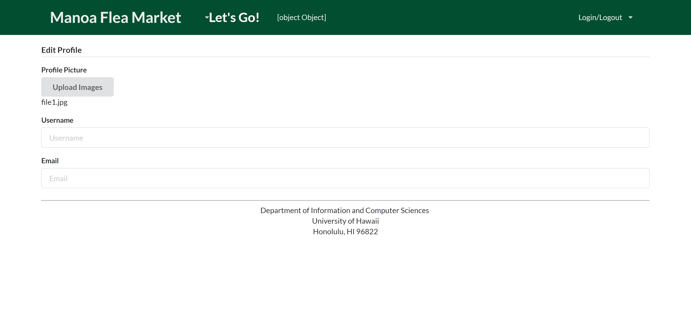

# Table of contents

* [About Manoa Flea Market](#about-manoa-flea-market)
* [Installation](#installation)
* [Development history](#development-history)
  * [Milestone 1](#milestone-1)
  * [Milestone 2](#milestone-2)

# About Manoa Flea Market

The Manoa Flea Market is a Meteor application that will offer UHM students a chance to sell or buy student-related goods and services. Similar to Craigslist, this application will: 

- Have students login with their UH credentials to access the system
- Connect buyers and sellers through UH credentials
- Items and services offered on this site will be geared specifically towards UHM students
- Users who violate the terms of use can be locked out of the system through their UH credentials

When you first come to our site, you will be on our landing page:


In order to use the system, you must be logged in. Once you click to log in, you will be directed to login with your UH username and password:


Once logged in, users will be directed to the User Home Page: 

 

Users will also be able to navigate through the top menu:


However, users who have admin privileges will be directed to the Admin Home Page:

 

From either Home Page, you can list an item to sell, making sure you give a description and a photo:


If need be, you may also choose to edit your listing: 


All the items for sale from the users will then be available on a communal sell page:


Users will also have profiles that can be viewed by other users that will list all items that the user is currently selling:


These profiles can be created or edited through the use of these pages: 



All the profiles will be accessible through a profiles list: 


# Installation

First, install [Meteor](https://www.meteor.com/install).

Second, download a copy of The Manoa Flea Market, or clone it using git.
(As of right now, the application is still under construction)
  
Third, cd into the app/ directory and install libraries with:

```
$ meteor npm install
```

Fourth, run the system with:

```
$ meteor npm run start
```

If all goes well, the application will appear at [http://localhost:3000](http://localhost:3000).

# Development History

The development process for the Manoa Flea market follows the ideas given in [Issue Driven Project Management](http://courses.ics.hawaii.edu/ics314s17/morea/project-management/reading-screencast-idpm.html). In a nutshell, development consists of a sequence of Milestones. Milestones consist of issues corresponding to 2-3 day tasks. GitHub projects are used to manage the processing of tasks during a milestone.  

The following sections document the development history of the Manoa Flea Market.

## Milestone 1

Milestone 1 started on April 4, 2017 and completed April 12, 2017. 

The goal of Milestone 1 is to combine all of the groups idea developed during our own mockup of this project and combine these pages to create an application that is uniform in looks and has the links to the other pages working. In order to meet this goal, the pages will be developed as a Meteor app and FlowRouter will be implemented in order to get the routing to the other pages to work.

Mockups for the following pages were implemented during M1:


Milestone 1 was implemented as [Manoa Flea Market Github Milestone 1](https://github.com/manoa-flea-market/manoa-flea-market/projects/1)::


Milestone 1 consisted of ten issues, and progress was managed via the [BowFolio GitHub Project M1](https://github.com/manoa-flea-market/manoa-flea-market/projects/1)::
=======
Milestone 1 currently has 10 issues and progress will be managed through [Manoa Flea Market Github Milestone 1](https://github.com/manoa-flea-market/manoa-flea-market/projects/1)::

.png)

Milestone 1 currently has 10 issues and progress will be managed through [Manoa Flea Market Github Milestone 1](https://github.com/manoa-flea-market/manoa-flea-market/milestone/1)::
>>>>>>> origin/master


Each issue was implemented in its own branch, and merged into master when completed:


Milestone 1 has been deployed through galaxy [Manoa Flea Market Demo](https://manoa-flea-market.meteorapp.com)::

## Milestone 2

Milestone 2 started on April 13, 2017 and is currently in progress.

Now that the mockup pages have been completed, the next step is to start working on our applications functionality.  Thus, the goal of milestone 2 is to implement the data model.

Milestone 2 was implemented as [Manoa Flea Market Github Milestone 2](https://github.com/manoa-flea-market/manoa-flea-market/milestone/2)::


Milestone 2 currently has 3 issues and progress will be managed through [Manoa Flea Market Github Milestone 2](https://github.com/manoa-flea-market/manoa-flea-market/milestone/2)::


